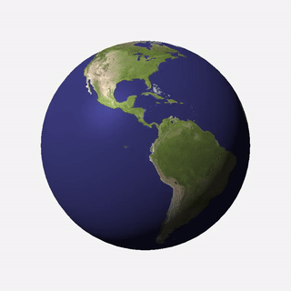
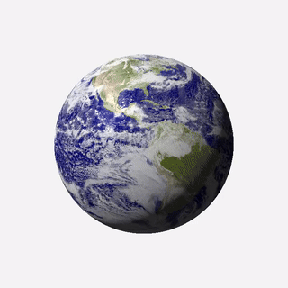

# SpinnyEarth

SpinnyEarth is a program that renders a video of the earth spinning, using the [raylib](https://www.raylib.com/index.html) library.

## Examples

## Dependencies
* `gcc` - compiler used
* `raylib` - used as graphics library
* `ffmpeg` - used to compile frames into a video

## Running the program
To run the program, make sure that the three shell script files are executable (`chmod +x *.sh`). Then, run the `buildrun.sh` script while inside the project folder (`./buildrun.sh`).

## Troubleshooting
Make sure all the dependencies are installed. If the program cannot find your raylib installation, copy the files from the `include/` and `lib/` folders of your raylib installation into the `lib/` folder.

For example, if you used homebrew to install raylib on macos, this is how you would copy the files:
* `cp /opt/homebrew/Cellar/raylib/5.0/include/* lib/`
* `cp /opt/homebrew/Cellar/raylib/5.0/lib/* lib/`